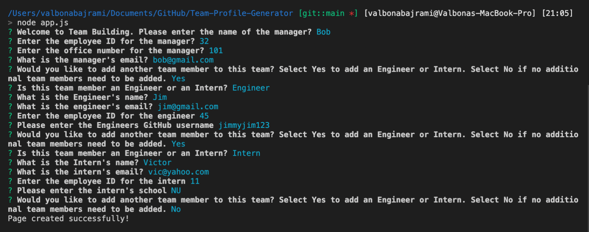
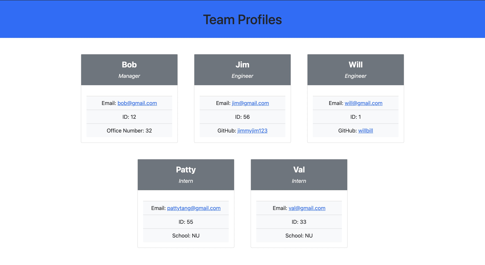
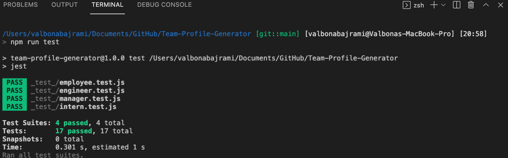

# Team-Profile-Generator


  
  ## Description
  A node.js application used to create and deploy an HTML file displaying team member information based on inputs from the user after a series of prompts. 
  
  ## Table of Contents 
  
  * [User Story](#userstory)
  * [Demo Video](#demovideo)
  * [Screenshots](#screenshots)
  * [Installation](#installation)
  * [Usage](#usage)
  * [Tech](#tech)
  * [License](#license)
  * [Contributors](#contributors)
  * [Tests](#tests)
  * [Questions](#questions)
  
  ## User Story
  ```md
  AS A manager
  I WANT to generate a webpage that displays my team's basic info
  SO THAT I have quick access to their emails and GitHub profiles
  ```
  
  ## Demo Video 

  🎥 The full video file showing functionality of the application can be found here: [link](https://drive.google.com/file/d/1paBfaafed2WMutkMsu3ejHpYv2GvrW79/view?usp=sharing) <br/>

 
  
  ## Screenshots

  This is an example of the inquirer prompt. 
   <br/> <br/>
  This is an example of the HTML that is generated after the user prompts.
  
  
  ## Installation
  
  Step 1: Run `npm install`. 

  Step 2: Run `npm i inquirer`. 

  Step 3: Run `node app.js`.
  
  
  ## Usage
  Use the command line to navigate to the root of the application and run `node app.js`.  Follow prompts to add team members to your roster. 
 

  ## Tech
  - NPM (dependencies: jest, fs, inquirer)
  - HTML
  - CSS (bootstrap)
  - JavaScript
  - Runs as Node CLI

  ## Contributors
  It is an open project and everyone can contribute. Please email requesting to be added as a contributor.
  
  ## License
  License is [MIT](https://opensource.org/licenses/MIT) standard license.
    
  
  ## Tests
  There is a set of tests requiring the use of the Jest package associated with the classes (employee, manager, intern, and engineer) used.

  To run tests, install
  ```
  npm install jest
  ```
  and run `npm run test` from the command line.

  

  
  ## Questions
   GitHub: https://github.com/valbona1992  <br/>
   Email me with any questions: valbona12@gmail.com
   